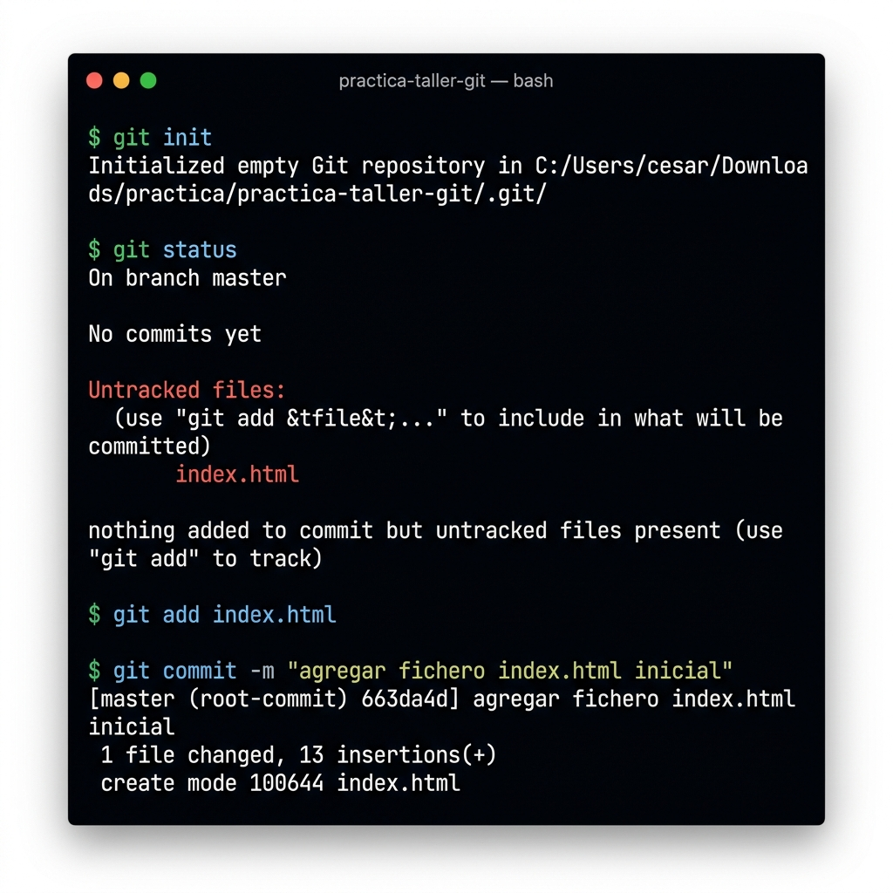
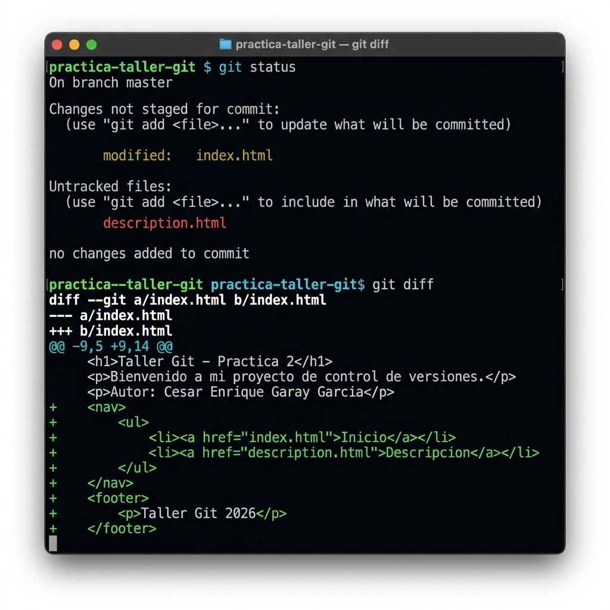
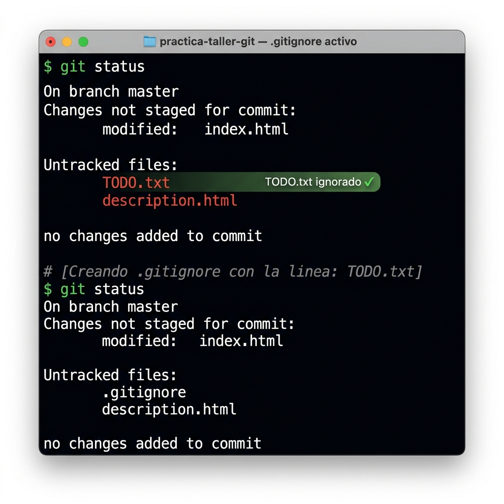
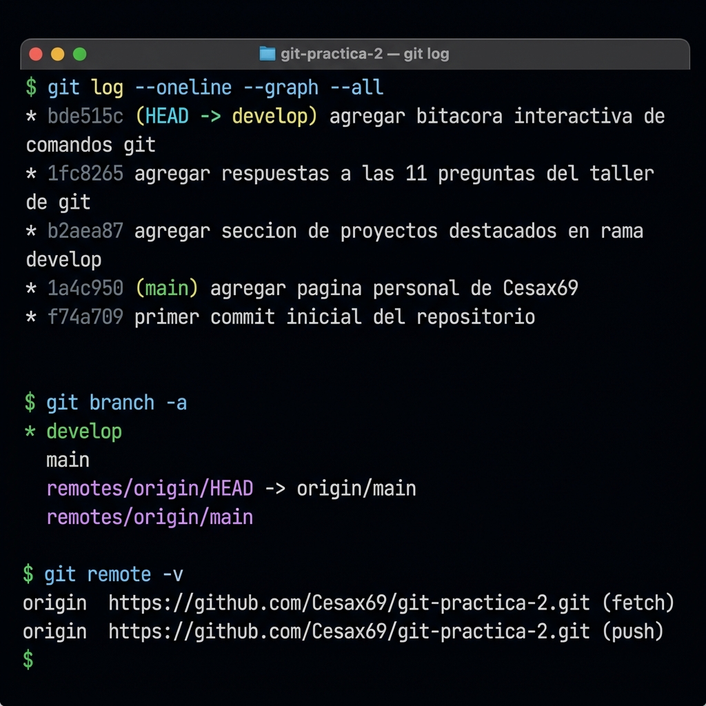

# Taller Git · Práctica 2
**Alumno:** César Enrique Garay García · **GitHub:** [@Cesax69](https://github.com/Cesax69)

Repositorio para la **Práctica 2 del Taller de Git**. Contiene el registro completo de los comandos ejecutados, sus resultados (capturas de terminal) y las respuestas al cuestionario.

---

## Parte 1 — Repositorio Local (`practica-taller-git`)

### 1. `git init` · Crear el repositorio + primer `git status` + `git add` + `git commit`

Se creó la carpeta `practica-taller-git`, se inicializó el repositorio con `git init`, se creó `index.html` y se realizó el primer commit.



```bash
git init
git status              # index.html aparece como "untracked"
git add index.html
git commit -m "agregar fichero index.html inicial"
```

---

### 2. `git status` + `git diff` — Añadir `description.html` y modificar `index.html`

Se creó el fichero `description.html` y se modificó `index.html` añadiendo una barra de navegación y un footer. Git detecta ambos cambios.



```bash
git status   # muestra: modified: index.html  |  untracked: description.html
git diff     # muestra exactamente qué líneas cambiaron dentro de index.html
```

---

### 3. `.gitignore` — Ignorar `TODO.txt`

Se creó el fichero `TODO.txt` de tareas personales. Antes de crear el `.gitignore`, Git lo detectaba. Después de crearlo con la línea `TODO.txt`, desapareció del rastreo.



```bash
# Contenido del .gitignore:
TODO.txt

git status   # TODO.txt ya NO aparece — solo .gitignore y description.html
git add .gitignore description.html index.html
git commit -m "agregar pagina de descripcion, actualizar navegacion e ignorar TODO.txt"
```

---

### 4. `git log` + `git branch` — Historial y ramas

Vista del historial de commits, las ramas locales y el remote configurado al repositorio forkeado.



```bash
git log --oneline --graph --all
git branch -a
git remote -v
```

---

## Parte 2 — Fork y Clon (`git-practica-2`)

### Flujo de trabajo realizado

```bash
# 1. Fork del repositorio del profesor en GitHub (botón Fork)
# 2. Clonar el fork personal
git clone https://github.com/Cesax69/git-practica-2.git

# 3. Crear el fichero personal
# → Cesax69.html (con nombre, información y diseño propio)

# 4. Añadir y confirmar
git add Cesax69.html
git commit -m "agregar pagina personal de Cesax69 (Cesar Enrique Garay Garcia)"

# 5. Subir al remoto  ← pendiente de revisión
git push

# 6. Crear rama develop y cambiarse a ella
git checkout -b develop

# 7. Realizar cambios, confirmar y subir
git status
git add *
git commit -m "agregar seccion de proyectos destacados en rama develop"
git push origin develop  ← pendiente de revisión

# 8. Desde GitHub → crear Pull Request: develop → main
# 9. Fusionar (Merge) el Pull Request
```

### Archivos del repositorio

| Archivo | Descripción |
|---|---|
| [`Cesax69.html`](Cesax69.html) | Página personal del alumno con nombre, tecnologías y proyectos |
| [`respuestas.md`](respuestas.md) | Respuestas completas a las 11 preguntas del taller |
| [`bitacora-git.html`](bitacora-git.html) | Visor interactivo de terminal con todos los comandos ejecutados |
| `capturas/` | Carpeta con las 4 capturas de terminal de la Parte 1 |

---

## Respuestas

Las respuestas a las 11 preguntas se encuentran en el fichero **[`respuestas.md`](respuestas.md)**.

---

*Taller Git · Práctica 2 · César Enrique Garay García · 2026*
